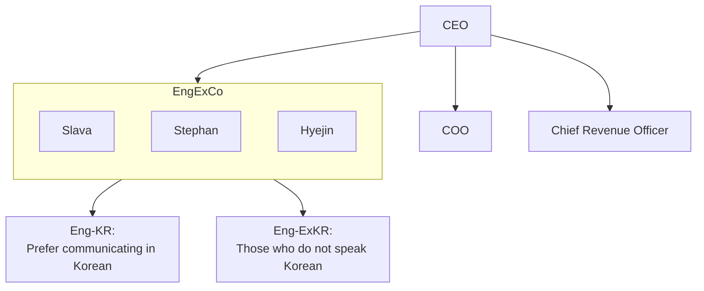

```mermaid
graph TD;
    CEO["CEO"]
    COO

    CEO --> COO
    CEO --> CRO["Chief Revenue Officer"]

    subgraph EngExCo
        direction TB
        VP_Eng["Slava"]
        CTO["Stephan"]
        Dir_Eng["Hyejin"]
    end
    %% CRO -.- EngExCo

    CEO --> EngExCo
    EngExCo --> Eng-KR
    EngExCo --> Eng-ExKR

    %% This is all Korean-speaking engineers
    subgraph Eng-KR [Eng-KR:
Prefer communicating in Korean]
    end
    %% This is all engineers based outside of Korea
    subgraph Eng-ExKR [Eng-ExKR:
Those who do not speak Korean]
    end


    %%DD[Director of Design]
    %%ADD["Assc Dir Design"]
    %%DD --> ADD

```
