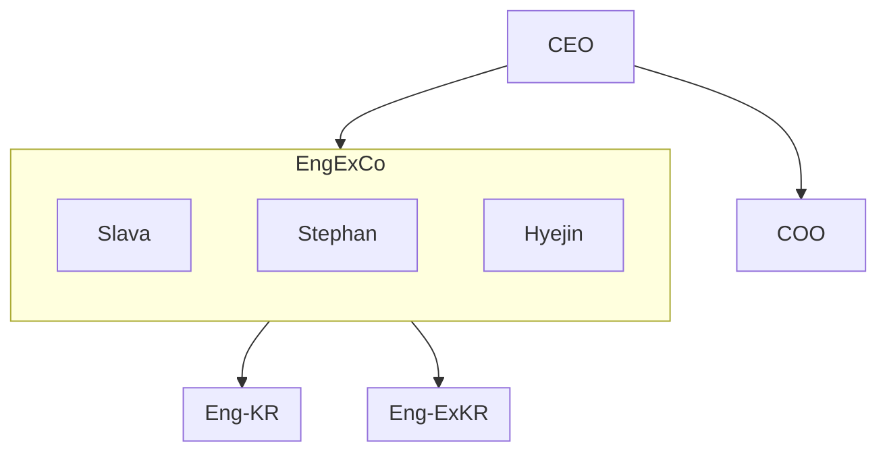

```mermaid
graph TD;
    CEO["CEO"]
    COO

    CEO --> COO

    subgraph EngExCo
        direction TB
        VP_Eng["Slava"]
        CTO["Stephan"]
        Dir_Eng["Hyejin"]
    end

    CEO --> EngExCo
    EngExCo --> Eng-KR
    EngExCo --> Eng-ExKR
    
    subgraph Eng-KR
    end
    subgraph Eng-ExKR
    end

    %%DD[Director of Design]
    %%ADD["Assc Dir Design"]
    %%DD --> ADD

```
